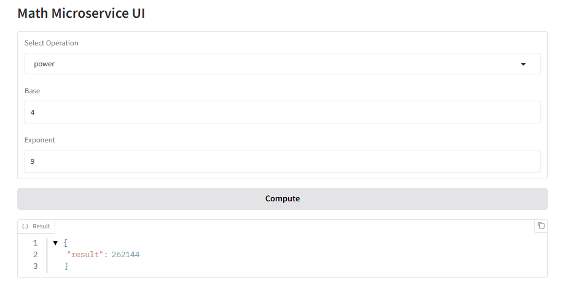
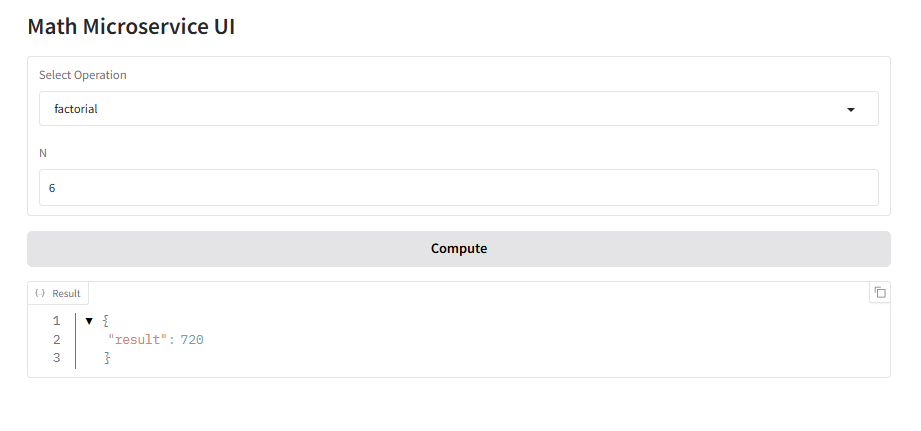
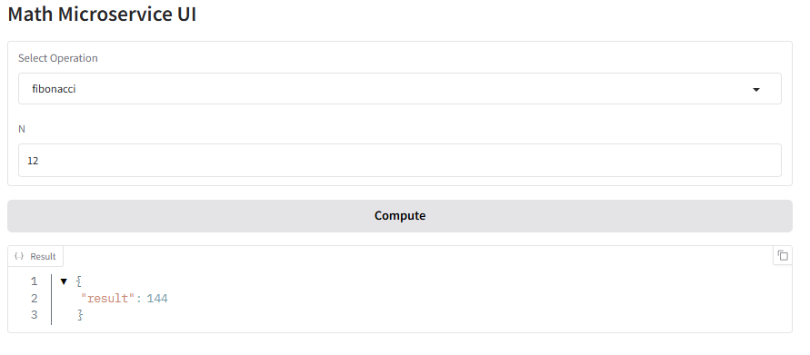

# Math Microservice API

## Description

This project is a RESTful microservice built using **FastAPI**. It provides endpoints to perform basic mathematical operations:

- **Power**: base raised to exponent  
- **Fibonacci**: returns the n-th Fibonacci number  
- **Factorial**: computes the factorial of a number

The service supports both **synchronous** and **asynchronous** computations, and all requests and results are logged to a local **SQLite** database.

## Technologies Used

- FastAPI for API development  
- Pydantic for request validation  
- SQLite for persistent storage  
- Uvicorn as ASGI server  
- Python `logging` module for structured logs  
- `asyncio.Queue` for async background processing

## How to Run

1. Install dependencies:

   ```bash
   pip install -r requirements.txt
   ```

2. Start the FastAPI server:

   ```bash
   uvicorn main_api:app --reload
   ```

3. Open Swagger UI in your browser:

   ```
   http://localhost:8000/docs
   ```

## API Endpoints

### POST `/compute`

Synchronously computes a math operation and returns the result.

**Request Example**:

```json
{
  "operation": "power",
  "inputs": {
    "base": 2,
    "exponent": 5
  }
}
```

**Response Example**:

```json
{
  "result": 32
}
```

### Supported Operations and Input Formats

| Operation  | Required Inputs                     |
|------------|-------------------------------------|
| power      | { "base": int, "exponent": int }    |
| fibonacci  | { "n": int }                        |
| factorial  | { "n": int }                        |

---

### POST `/compute_async`

Queues the operation for asynchronous background processing. The result is computed in the background and stored in the database.

**Request Example**:

```json
{
  "operation": "fibonacci",
  "inputs": {
    "n": 35
  }
}
```

**Response Example**:

```json
{
  "status": "accepted",
  "message": "fibonacci task queued"
}
```

---

### GET `/history`

Returns all previously executed operations (both sync and async), including inputs, results, and timestamps.

**Response Example**:

```json
[
  {
    "operation": "power",
    "inputs": "{'base': 2, 'exponent': 5}",
    "result": "32",
    "timestamp": "2025-07-30T11:25:32.121Z"
  },
  {
    "operation": "fibonacci",
    "inputs": "{'n': 35}",
    "result": "9227465",
    "timestamp": "2025-07-30T11:30:57.571Z"
  }
]
```

---

## Error Handling

All inputs are validated using Pydantic. Common error responses include:

**Invalid operation**:

```json
{
  "detail": "Unsupported operation"
}
```

**Missing inputs**:

```json
{
  "detail": "Missing 'base' or 'exponent'"
}
```


## Gradio Frontend (UI)

This project includes an optional **Gradio-based web interface** for interacting with the API.

### How to Run the Gradio UI

1. Make sure the FastAPI server is already running:

   ```bash
   uvicorn main_api:app --reload
   ```

2. In a separate terminal, launch the Gradio interface:

   ```bash
   python gradio_frontend.py
   ```

3. Open your browser at: [http://localhost:7860/](http://localhost:7860/)

### Gradio Features

- Select one of the operations: power, fibonacci, or factorial
- Enter the appropriate input values
- Click **Compute** to send a request to the backend API
- View the response directly in the web interface

This provides a quick and user-friendly way to test the API without using Swagger or Postman.


## Logging
All requests and results are logged to a local SQLite database. The log entries include:
- Operation type (power, fibonacci, factorial)
- Input parameters
- Result of the computation
- Timestamp of the request
This allows for easy tracking and debugging of operations.

## Database Schema

The SQLite database schema is automatically created when the application starts. It includes a single table `operations` with the following fields:
| Column      | Type         | Description                          |
|-------------|--------------|--------------------------------------|
| id          | INTEGER      | Primary key                          |
| operation   | TEXT         | Type of operation (power, fibonacci, factorial) |
| inputs      | TEXT         | JSON representation of input parameters |
| result      | TEXT         | Result of the computation            |
| timestamp   | TIMESTAMP    | Time when the operation was requested |

 
 
## Operations

### Power

Raises a number (base) to the power of an exponent.



---

### Factorial

Computes the factorial of a non-negative integer `n` (i.e., `n! = n × (n-1) × ... × 1`).



---

### Fibonacci

Returns the `n`-th number in the Fibonacci sequence (`0, 1, 1, 2, 3, 5, ...`).


